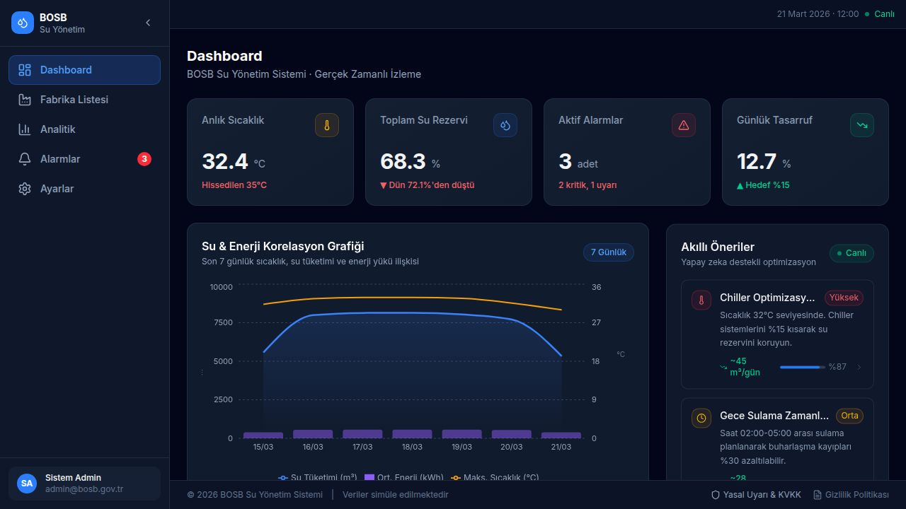

# 🌊 WEN System - Industrial Water Management Dashboard

Bursa Organize Sanayi Bölgesi (BOSB) standartlarına uygun olarak geliştirilmiş; gerçek zamanlı su tüketimi, basınç takibi ve acil durum protokollerini yöneten endüstriyel bir paneldir.

🚀 **[Canlı Demoyu Görüntüle](https://wen-system-demo.vercel.app/)**

## ✨ Öne Çıkan Özellikler
* **Endüstriyel Karanlık Tema:** Fabrika ortamına uygun, yüksek kontrastlı "Industrial Slate" tasarımı.
* **Acil Durum Protokolü (KOD KIRMIZI):** Tek tuşla tüm vana sistemlerini durduran ve uyarı veren simülasyon modu.
* **Dinamik Veri Görselleştirme:** Tüketim akış hızı ve şebeke basıncının anlık takibi.
* **Bursa Odaklı Yapı:** Bölgesel altyapı ihtiyaçlarına yönelik özelleştirilmiş arayüz.

## 🛠️ Teknolojiler
* **Framework:** React + Vite
* **Styling:** Tailwind CSS
* **Animasyonlar:** Framer Motion
* **İkonlar:** Lucide React
* **Yayın (Deployment):** Vercel

## ⚙️ Yerel Kurulum
1. `git clone https://github.com/gulbeyzadurdu/WEN-System-Demo.git`
2. `npm install`
3. `npm run dev`
